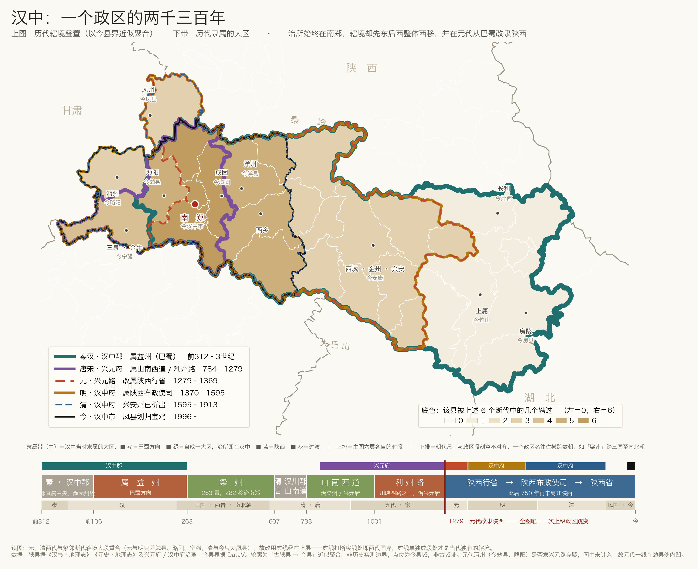

# admin-division-history

一个 [Claude Code](https://claude.com/claude-code) skill：给一个地方（汉中、西安、徽州……）
画一张历代行政区划变迁图。



## 它解决什么问题

「某地自古以来的行政区划变迁」其实是三件正交的事，塞进一张地图必乱：

| | 变的是什么 | 地图能表达吗 |
|---|---|---|
| 辖境 | 管过多大，哪块割给了谁 | 能 |
| 隶属 | 归谁管，什么时候改的嫁 | 不能 |
| 名与级 | 郡 → 州 → 府 → 市 | 不能 |

所以固定成「主图 + 隶属带」的双区结构，一张 PNG 交付：

- **主图**：历代辖境轮廓叠置在今日县界底板上。底色是每个今县被历代辖过的**次数**
  ——深＝哪朝都管的铁核心，浅＝只属过一两代的边缘。
- **隶属带**：横向时间轴三行。上排＝各断代的时段（与主图轮廓同色，用来上下对照），
  中排＝当时隶属的大区，下排＝朝代尺。

以汉中为例，图上能直接读出来的：治所两千三百年钉在南郑没动过，辖境却从「汉江中游
向东伸到今房县、竹山」整体挪成了「汉江上游向西到略阳、宁强」；而元代那条红竖线之后，
隶属再没变过。

## 用法

```bash
# 1. 拉今日行政区划边界（地市代码 → 下辖县级面；--prov 取省界）
python3 scripts/fetch_bounds.py --dir configs/bounds --prov 610700 610900 420300

# 2. 照 configs/hanzhong.py 写一份配置，然后渲染
python3 scripts/render.py configs/hanzhong.py
```

配置里最要紧的是 `eras`：每个断代的辖县列表（写今县名）、颜色、线宽、图层。
schema 与字段含义见 `configs/hanzhong.py` 的注释。

## 两个容易翻车的地方

**一、相邻断代辖境大段重合时，后画的线会把先画的完全吞掉。** 汉中的元代与明代只差
三个县，元线画完只剩孤零零一小段，看起来像画残了。解法：线宽按年代递减、早期在下，
让重合段呈「年轮」嵌套；高度重合的那一代改用**细虚线并叠到上层**，虚线打断实线处即
两代同界，虚线单独成段处才是当代独有的辖境。

**二、隶属要三分，不是二分。** 直觉上只有「属 A」「属 B」，但会漏掉第三种：
**这座城自己就是大区治所**，不从属于任何一边（汉中的梁州、山南西道两段）。
三分之后才能读出「当中心多少年、当附庸多少年、当边角多少年」。

## 数据与精度

- 今县界 / 省界：[阿里云 DataV](https://geo.datav.aliyun.com/areas_v3/bound/) 免费接口，
  点位取 `properties.center`（民政部口径的政府驻地）。
- 历代辖境：把当时的辖县换算成**今县集合**再合并成面。这是近似——古县境 ≠ 今县境，
  **不是历史实测边界**，图注必须写明。要真边界应当改用 CHGIS
  （复旦 / 哈佛中国历史地理信息系统）的矢量数据。
- 查不到定论的一律不计入，并在图注点明它造成的形状异常，
  让读者知道那个缺口是存疑的痕迹而不是绘图错误。

## 安装

```bash
git clone https://github.com/lixin4306ren/admin-division-history-skill.git \
  ~/.claude/skills/admin-division-history
```

依赖：`geopandas`、`shapely`、`matplotlib`。中文字体路径在 `scripts/render.py`
顶部的 `FP`，默认 macOS 的 Hiragino Sans GB，其他系统改成本机可用的中文字体。

## License

MIT
